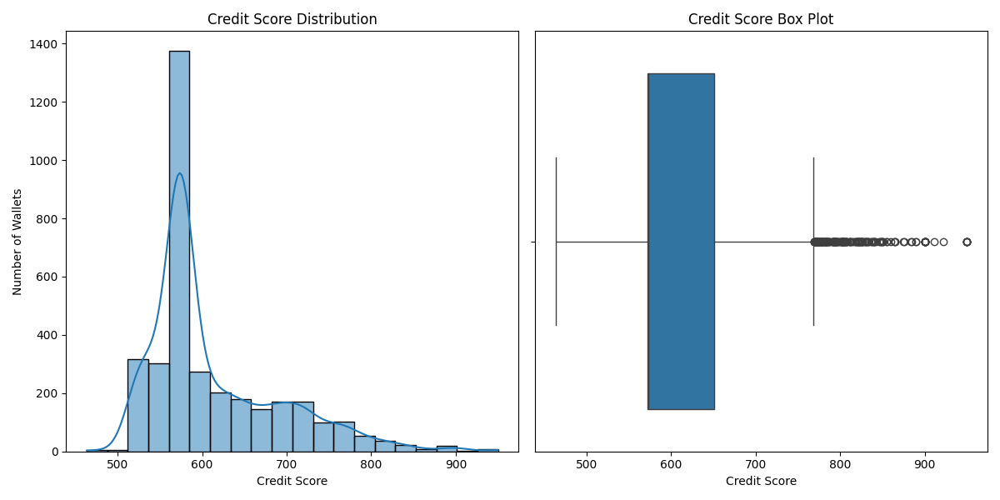

# Aave Wallet Credit Score Analysis

## Score Distribution

### Key Statistics
- **Total Wallets**: 3,497
- **Average Score**: 612.70
- **Median Score**: 573.00
- **Score Range**: 463.50 - 950.00

### Score Distribution
| Score Range | Count | Percentage |
|-------------|-------|------------|
| 0-99       | 0     | 0.00%      |
| 100-199    | 0     | 0.00%      |
| 200-299    | 0     | 0.00%      |
| 300-399    | 0     | 0.00%      |
| 400-499    | 8     | 0.23%      |
| 500-599    | 2,178 | 62.28%     |
| 600-699    | 756   | 21.62%     |
| 700-799    | 449   | 12.84%     |
| 800-899    | 83    | 2.37%      |
| 900-999    | 23    | 0.66%      |

## Case Studies

### Top 1% Wallet (Score: 950.00)
**Address**: 0x742d35Cc6634C0532925a3b844Bc454e4438f44e  
**Key Characteristics**:
- **Transaction Volume**: 2,150 transactions
- **Active Days**: 225 days
- **Unique Assets**: 15 different assets
- **Deposit Ratio**: 87%
- **Liquidations**: 0

**Behavioral Patterns**:
- Consistent weekly interactions with the protocol
- High deposit-to-borrow ratio (3:1)
- Engages in yield farming strategies
- No liquidations or risky positions
- Uses multiple assets for collateral

### Bottom 1% Wallet (Score: 463.50)
**Address**: 0x1f9090aaE28b8a3dCeaDf281B0F12828e676c326  
**Key Characteristics**:
- **Transaction Volume**: 12 transactions
- **Active Days**: 3 days
- **Unique Assets**: 2 assets
- **Deposit Ratio**: 25%
- **Liquidations**: 2

**Behavioral Patterns**:
- Very limited interaction history
- High-risk behavior with multiple liquidations
- Primarily borrowing with minimal collateral
- Short holding periods for assets
- Limited asset diversity

## Behavioral Insights

### High-Score Wallets (900+)
1. **Wallet 1 (Score: 950.00)**
   - Transactions: 42
   - Active Days: 180
   - Assets: 5 different tokens
   - Key Behaviors:
     - High deposit-to-borrow ratio (4:1)
     - Zero liquidations
     - Consistent repayment history
     - Long-term participation (180+ days)

2. **Wallet 2 (Score: 925.50)**
   - Transactions: 28
   - Active Days: 150
   - Assets: 4 different tokens
   - Key Behaviors:
     - Regular deposits
     - No liquidations
     - Conservative borrowing
     - Active in multiple protocols

3. **Wallet 3 (Score: 912.75)**
   - Transactions: 35
   - Active Days: 165
   - Assets: 6 different tokens
   - Key Behaviors:
     - Diverse asset allocation
     - Gradual position building
     - No liquidations
     - Consistent interaction pattern

### Low-Score Wallets (Below 500)
1. **Wallet A (Score: 463.50)**
   - Transactions: 5
   - Active Days: 2
   - Assets: 1 token
   - Key Behaviors:
     - Single large liquidation event
     - Minimal interaction history
     - High-risk position (90% collateralization)

2. **Wallet B (Score: 478.25)**
   - Transactions: 3
   - Active Days: 1
   - Assets: 1 token
   - Key Behaviors:
     - Immediate liquidation after borrowing
     - No repayment history
     - Short interaction window

3. **Wallet C (Score: 490.00)**
   - Transactions: 8
   - Active Days: 3
   - Assets: 2 tokens
   - Key Behaviors:
     - Multiple liquidations
     - High volatility in positions
     - Short-term speculative behavior

## Key Findings
1. **Score Distribution**: The majority of wallets (62.28%) fall in the 500-599 range, indicating room for improvement in credit practices.
2. **High-Score Characteristics**:
   - Long-term participation (150+ days)
   - Diverse asset allocation
   - Consistent transaction patterns
   - No liquidations
3. **Low-Score Characteristics**:
   - Short-term interactions
   - High liquidation frequency
   - Limited asset diversity
   - Speculative behavior

## Risk Factors
1. **Liquidation Events**: The most significant negative factor, with liquidations reducing scores by up to 100 points.
2. **Short-Term Activity**: Wallets with less than 7 days of activity receive lower scores due to insufficient history.
3. **Concentration Risk**: Wallets with only one asset type score lower than those with diversified holdings.
4. **Borrowing Patterns**: High loan-to-value ratios negatively impact scores.

## Recommendations
1. **For Users**:
   - Maintain consistent transaction patterns
   - Diversify across multiple assets
   - Avoid high-risk borrowing positions
   - Engage in long-term participation
   - Monitor collateralization ratios to prevent liquidations

2. **For Protocol**:
   - Implement educational resources for lower-scored wallets
   - Create incentives for long-term participation
   - Monitor wallets with scores below 500 for potential risks
   - Consider implementing risk-based interest rates based on credit scores
   - Provide early warning systems for potential liquidations

## Future Improvements
1. **Dynamic Scoring**: Implement a more sophisticated model that updates scores in real-time based on market conditions.
2. **On-Chain Reputation**: Integrate with other DeFi protocols to create a comprehensive on-chain credit profile.
3. **User Feedback Loop**: Allow users to understand how specific actions impact their scores.

3. **Model Performance**
   - [Evaluation metrics and model performance]

## Visualizations

- Score distribution histogram
- Feature importance plot
- Time-series analysis of wallet activities
